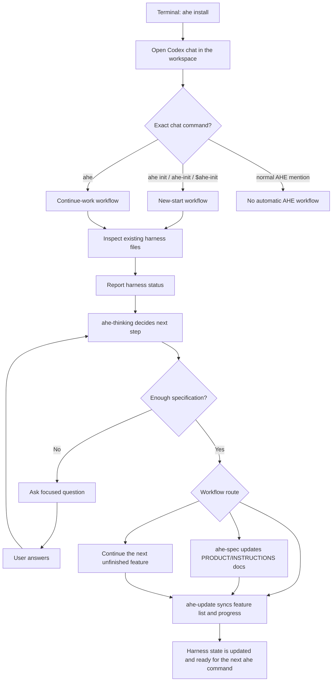

# Awesome Harness Engineering (AHE)

Codex chat workflow skill installer for Awesome Harness Engineering.

This project provides a set of Codex skills and templates to automatically build project harnesses. It is designed to be used directly within a Codex chat conversation, guiding users through the engineering workflow.

## Installation

### For End Users
To install the Codex skills in your current workspace, run:

```bash
npx --yes --package=@ksuchoi216/ahe ahe install
```

Alternatively, you can install it globally:

```bash
npm install -g @ksuchoi216/ahe
ahe install
```

### For Local Development
If you have cloned the repository and want to install it locally:

```bash
npx --yes --package=file:. ahe install
```

## Usage

Once installed, the `ahe` skills will be added to your `.codex` directory.

The terminal command installs and maintains the Codex skills. The actual harness workflow runs in Codex chat.

### Codex Chat Commands

Open Codex chat in the target workspace and use one of these exact prompts:

- `ahe init`: Start or restart harness setup.
- `ahe-init`: Alias for `ahe init`.
- `$ahe-init`: Codex skill-style alias for `ahe init`.
- `ahe`: Continue existing harness work.

Normal prompts that merely mention AHE, such as `explain ahe`, should not start the automatic workflow.

### Available CLI Commands

The command-line interface is primarily used for the installation and maintenance of the Codex skills:

- `ahe install [--force] [--backup]`: Installs or updates the skills in your `.codex/` directory.
- `ahe uninstall`: Removes installed AHE skills, shared assets, and hooks from the current workspace.
- `ahe doctor`: Checks the health and integrity of your AHE skill installation.
- `ahe version`: Prints the current version.

## How AHE Works

`ahe init` is the new-start path. It creates or refreshes the harness files, asks for missing project/specification details, writes the product contract, and updates tracking artifacts.

Exact `ahe` is the continue-work path. It inspects the current harness state, reports status, decides the next safe workflow, asks the user only when required information is missing, and then continues execution.



## Project Structure

- `bin/ahe`: The main CLI executable for installing the skills.
- `.codex/skills/`: Contains the managed Codex skills (`ahe-init`, `ahe-conversation`, `ahe-thinking`, `ahe-spec`, `ahe-update`).
- `.codex/ahe-shared/`: Contains shared assets like `templates` and `schemas`.
- `AGENTS.md`: Defines the project objectives, global rules, and startup workflow.

## Agent Working Rules

If you are an AI agent working on this repository, please strictly follow the guidelines in [AGENTS.md](AGENTS.md). It includes critical instructions regarding the definition of done, verification commands, and file modification rules (e.g., you must update `PROGRESS.md` and `feature-list.json` appropriately).

## License

MIT
