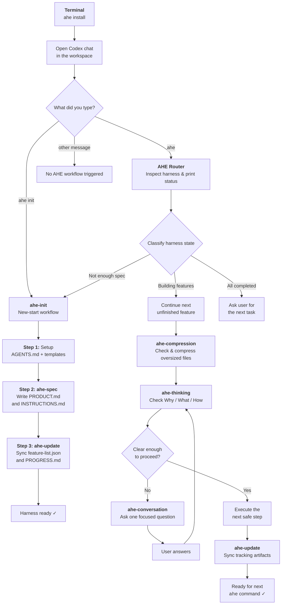

# Awesome Harness Engineering (AHE)

AHE automatically builds and maintains project harnesses through Codex chat. It installs a set of Codex skills into your workspace, then guides you through defining your project specification, tracking features, and managing progress — all via natural conversation.

---

## 1. Installation

### Quick Start (Recommended)

```bash
npx --yes --package=@ksuchoi216/ahe ahe install
```

### Global Install

```bash
npm install -g @ksuchoi216/ahe
ahe install
```

### Local Development

After cloning the repository:

```bash
npx --yes --package=file:. ahe install
```

### CLI Commands

| Command                | Description                                     |
| ---------------------- | ----------------------------------------------- |
| `ahe install`          | Install AHE skills into `.codex/`               |
| `ahe install --force`  | Overwrite existing installation                 |
| `ahe install --backup` | Backup existing installation before overwriting |
| `ahe uninstall`        | Remove all AHE skills, shared assets, and hooks |
| `ahe doctor`           | Check installation health and integrity         |
| `ahe version`          | Print the current version                       |

---

## 2. How to Use

AHE works inside **Codex chat**. After installing via the terminal, open Codex chat in your workspace and type one of the commands below.

### Chat Commands

| Command    | What it does                                                                                                            |
| ---------- | ----------------------------------------------------------------------------------------------------------------------- |
| `ahe init` | **Start a new harness.** Creates harness skeleton files, asks about your project, and writes the product specification. |
| `ahe`      | **Continue existing work.** Inspects the current state, reports status, decides the next step, and keeps working.       |

> **Note:** Only exact commands trigger AHE. Normal messages like "explain ahe" or "what does ahe do" will not start any workflow.

### Typical Workflow

```
# Step 1: Install AHE skills into your project
$ ahe install

# Step 2: Open Codex chat and initialize the harness
> ahe init
  → AHE asks about your project purpose, language, tech stack, constraints...
  → Creates AGENTS.md, feature-list.json, PROGRESS.md, docs/PRODUCT.md, etc.

# Step 3: Continue working — just type "ahe"
> ahe
  → AHE inspects the harness state and prints a status report
  → Picks the next unfinished feature or asks for missing info
  → Works on it, then updates tracking artifacts

# Step 4: Keep iterating
> ahe
  → Reports progress, moves to the next feature
  → Repeat until all features are done
```

---

## 3. How It Works

### Skills Overview

AHE is composed of six core skills that coordinate automatically:

| Skill                | Role                                                                                                                                              |
| -------------------- | ------------------------------------------------------------------------------------------------------------------------------------------------- |
| **ahe-init**         | Entry point for new projects. Creates harness files, asks for project info, then calls ahe-spec and ahe-update.                                   |
| **ahe-thinking**     | Internal decision engine. Evaluates clarity on **Why** / **What** / **How** for each work unit and routes to the right action.                    |
| **ahe-compression**  | Internal size detector & compressor. Monitors file sizes via configurable thresholds (`config.yaml`) and compresses bloated files before reading. |
| **ahe-conversation** | Internal question protocol. Asks exactly one focused question at a time when information is missing.                                              |
| **ahe-spec**         | Writes and updates `docs/PRODUCT.md` (canonical source of truth) and `docs/INSTRUCTIONS.md`.                                                      |
| **ahe-update**       | Syncs tracking artifacts: `feature-list.json`, `PROGRESS.md`, `SESSION-HANDOFF.md`.                                                               |

### Process Flow



### Detailed Steps

#### `ahe init` — New Start

1. Scans the workspace for existing harness files.
2. If files exist, asks the user what scope to restart (full restart, product-only, or custom).
3. Backs up affected files to `.ahe/backups/`.
4. Asks about project purpose, language, and tech stack.
5. Deploys template files (`AGENTS.md`, `PROGRESS.md`, `SESSION-HANDOFF.md`, `feature-list.json`, `init.sh`).
6. Calls **ahe-spec** → writes `docs/PRODUCT.md` and `docs/INSTRUCTIONS.md`.
7. Calls **ahe-update** → derives features and syncs tracking artifacts.

#### `ahe` — Continue Work

1. Hook injects the AHE router directive into the agent context.
2. Router inspects all harness files and prints a status table.
3. Classifies the current state:
   - **"Not enough spec"** → routes to `ahe-init` to fill gaps.
   - **"Building features"** → picks the next unfinished feature from `feature-list.json`.
   - **"All completed"** → asks the user for the next task.
4. **ahe-thinking** checks file sizes using **ahe-compression** and compresses oversized files based on `config.yaml` thresholds.
5. **ahe-thinking** checks clarity (Why / What / How) for the current work unit.
6. If unclear → **ahe-conversation** asks exactly one question, then re-evaluates.
7. If clear → executes the next safe step.
8. **ahe-update** syncs all tracking artifacts at the end.

#### Execution Loop

The core loop repeats until the work unit is done:

```
thinking → conversation (if needed) → execution → thinking
```

---

## Project Structure

After `ahe install`, the following structure is added to your workspace:

```
your-project/
├── .codex/
│   ├── skills/
│   │   ├── ahe-init/           # New-start workflow skill
│   │   ├── ahe-conversation/   # Internal question protocol
│   │   ├── ahe-thinking/       # Internal decision engine
│   │   ├── ahe-compression/    # Internal size detector & compressor
│   │   ├── ahe-spec/           # Specification writer
│   │   └── ahe-update/         # Tracking artifact syncer
│   ├── ahe-shared/
│   │   ├── config.yaml         # Compression thresholds & configuration
│   │   ├── templates/          # Harness file templates
│   │   └── schemas/            # Validation schemas
│   └── hooks/
│       ├── hooks.json          # Chat command trigger patterns
│       └── ahe-hook.js         # Hook script that injects directives
```

After `ahe init`, the harness files are created in your project root:

```
your-project/
├── docs/
│   ├── PRODUCT.md              # Product specification (source of truth)
│   └── INSTRUCTIONS.md         # Implementation instructions
├── .ahe/
│   └── process_status.json     # Workflow state persistence
├── AGENTS.md                   # Project objectives and agent rules
├── feature-list.json           # Feature state tracker (derived from PRODUCT.md)
├── PROGRESS.md                 # Session continuity log
├── SESSION-HANDOFF.md          # Handoff notes between sessions
└── init.sh                     # Standard startup/verification script
```

## Agent Working Rules

If you are an AI agent working on this repository, please strictly follow the guidelines in [AGENTS.md](AGENTS.md). It includes critical instructions regarding the definition of done, verification commands, and file modification rules (e.g., you must update `PROGRESS.md` and `feature-list.json` appropriately).

## References

This repository was greatly influenced by the following projects:

- [oh-my-openagent](https://github.com/code-yeongyu/oh-my-openagent): Greatly influenced the code structure of this project.
- [learn-harness-engineering](https://github.com/walkinglabs/learn-harness-engineering): Provided the harness engineering templates used in this project.

## License

MIT
