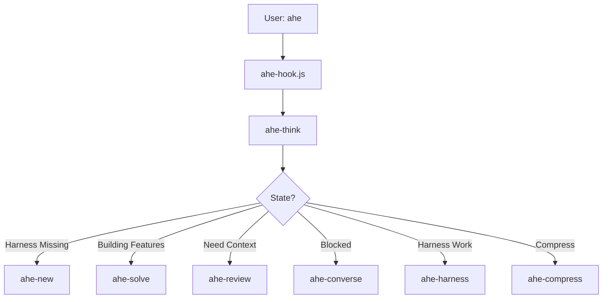
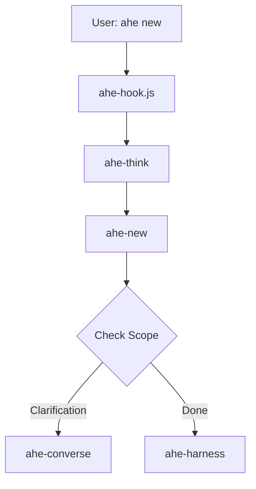
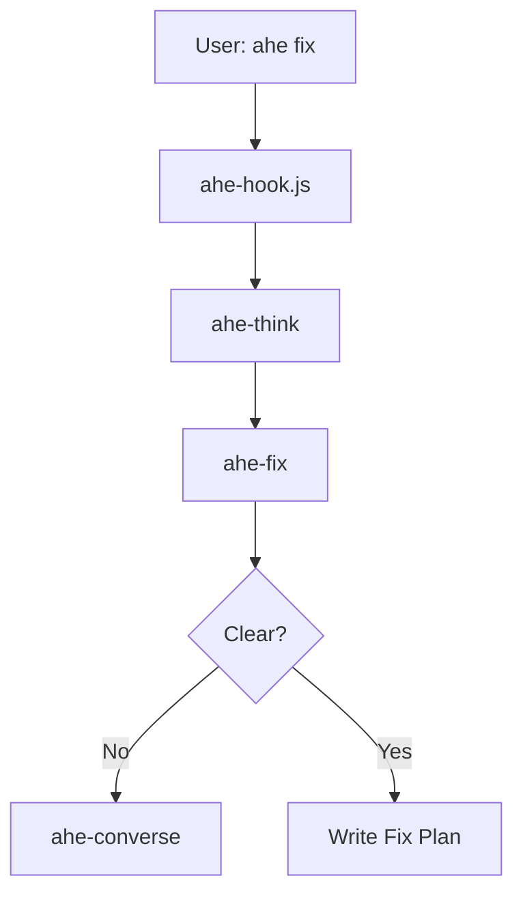
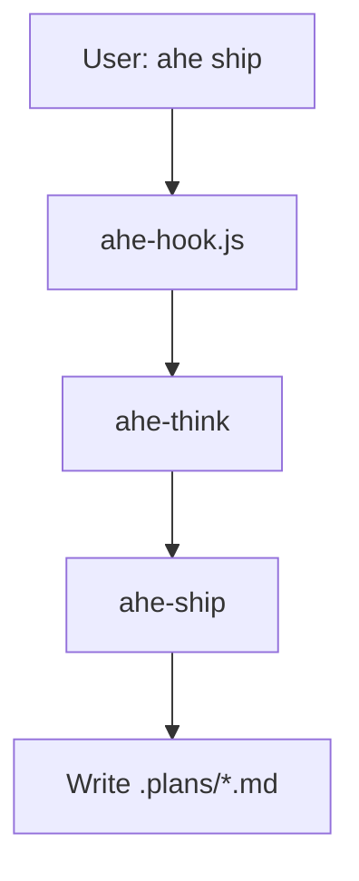

# Awesome Harness Engineering (AHE) Overview

AHE is a framework and set of managed skills designed to maintain project harnesses (documentation, requirements, testing) and route work systematically through AI agents.

## Public Entrypoints

You interact with AHE using the following user-facing commands:
- **`ahe` / `ahe <query>`**: Automatically inspects the harness state and routes to the correct next step. For example: `ahe`, `ahe update product spec`, or `ahe compress`.
- **`ahe new` / `ahe-new`**: Starts the initialization or reset flow for a workspace.
- **`ahe fix` / `ahe fix <query>`**: Starts fix planning when an error occurs or user intent shifts, skipping normal continuation. For example: `ahe fix stale tests`.
- **`ahe ship`**: Writes out the latest Plan Mode plan into `.plans/{plan_name}.md` without automatically executing it.

## Thinker-Centered Routing Model

AHE operates through a central decision layer: **`ahe-think`**. This internal agent determines the current state of the harness and delegates tasks to specialized sub-skills:
- **`ahe-harness`**: Builds and maintains product docs, instructions, and tracking state.
- **`ahe-review`**: Explores the codebase and reads files to understand context.
- **`ahe-converse`**: Pauses and asks the user for clarification when blocked.
- **`ahe-feature`**: Sizes and extracts new features from product documentation.
- **`ahe-solve`**: Solves or plans specific features.
- **`ahe-compress`**: Handles artifact size reduction when the harness grows too large.

These internal sub-skills are not user-facing commands.

## Main Flows

### 1. `ahe` (Continuous Execution)

### 2. `ahe new` (Initialization)

### 3. `ahe fix` (Fix Planning)

### 4. `ahe ship` (Export Plan)

