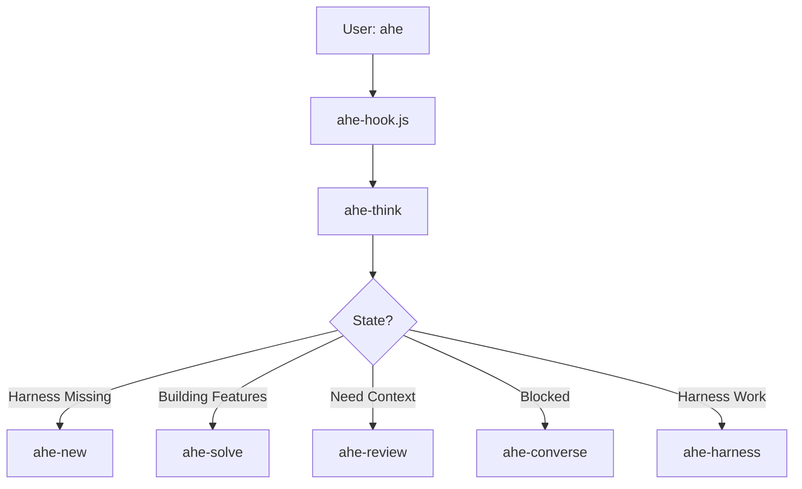
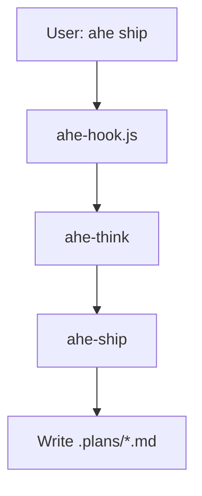
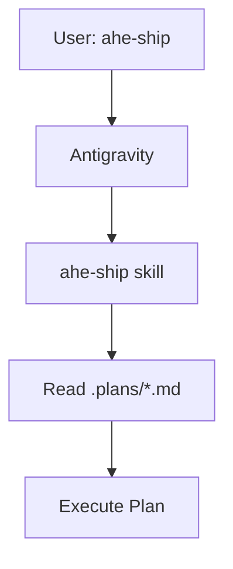
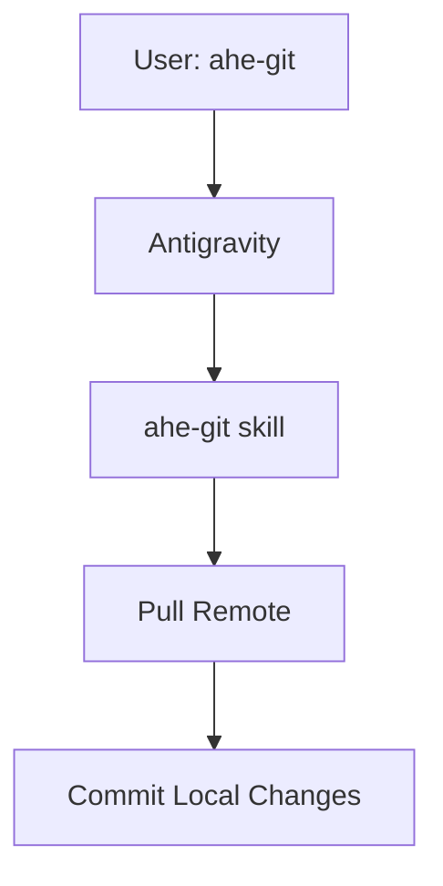

# Awesome Harness Engineering (AHE) Overview

AHE is a framework and set of managed skills designed to maintain project harnesses (documentation, requirements, testing) and route work systematically through AI agents.

## Public Entrypoints

You interact with AHE using the following user-facing commands:
- **`ahe` / `ahe <query>` / `<query> ahe`**: Automatically inspects the harness state and routes to the correct next step. This same entrypoint covers new-workspace bootstrap, normal continuation, and user-directed follow-up such as `ahe update product spec` or `ahe fix stale tests`.
- **`ahe ship`**: In Codex, saves the latest Plan Mode plan into `.plans/{plan_name}.md` without automatically executing it. In Antigravity, refreshes and executes exactly one plan from `.plans/`.
- **`ahe-git`**: In Antigravity, safely pulls and commits all nested repositories.

`ahe-overview` remains an explanation helper, not part of the normal work-routing surface.

## Thinker-Centered Routing Model

AHE operates through a central decision layer: **`ahe-think`**. This internal agent determines the current state of the harness and delegates tasks to specialized sub-skills:
- **`ahe-harness`**: Builds and maintains product docs, instructions, and tracking state.
- **`ahe-review`**: Explores the codebase and reads files to understand context.
- **`ahe-converse`**: Pauses and asks the user for clarification when blocked.
- **`ahe-feature`**: Sizes and extracts new features from product documentation.
- **`ahe-solve`**: Solves or plans specific features.
- **`ahe-new`**: Internal bootstrap worker used when `ahe-think` detects that the workspace has no usable harness yet.

These internal sub-skills are not user-facing commands.

## Main Flows

### 1. `ahe` (Continuous Execution)

```mermaid
graph TD;
    User[User: ahe] --> Hook[ahe-hook.js]
    Hook --> Think[ahe-think]
    Think --> State{State?}
    State -- Harness Missing --> New[ahe-new]
    State -- Building Features --> Solve[ahe-solve]
    State -- Need Context --> Review[ahe-review]
    State -- Blocked --> Converse[ahe-converse]
    State -- Harness Work --> Harness[ahe-harness]
```

### 2. `ahe ship` (Export / Execute Plan)

**In Codex (Export):**

```mermaid
graph TD;
    User[User: ahe ship] --> Hook[ahe-hook.js]
    Hook --> Think[ahe-think]
    Think --> Ship[ahe-ship]
    Ship --> Write[Write .plans/*.md]
```

**In Antigravity (Execute):**

```mermaid
graph TD;
    User[User: ahe-ship] --> Antigravity
    Antigravity --> ShipSkill[ahe-ship skill]
    ShipSkill --> Read[Read .plans/*.md]
    Read --> Execute[Execute Plan]
```

### 3. `ahe-git` (Repository Sync)

**In Antigravity:**

```mermaid
graph TD;
    User[User: ahe-git] --> Antigravity
    Antigravity --> GitSkill[ahe-git skill]
    GitSkill --> Pull[Pull Remote]
    Pull --> Commit[Commit Local Changes]
```

## Example of How to Use

### Harness Engineering
1. `ahe`
(in a workspace with no harness, `ahe-think` routes internally to `ahe-new`)
2. `ahe update product spec`
(update product documentation)
3. `ahe add dashboard export feature`
(implement a specific feature)

### ahe-ship in Codex and Antigravity
after planning in codex
1. `ahe-ship` in codex
(save the plan to .plans)
2. `ahe-ship` in antigravity
(implement one of plans in .plans)

### ahe-git
1. `ahe-git` in antigravity
(safely pull and commit all nested repositories)
